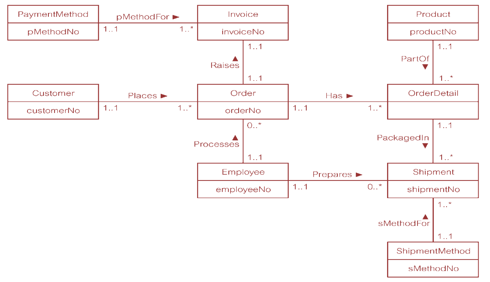
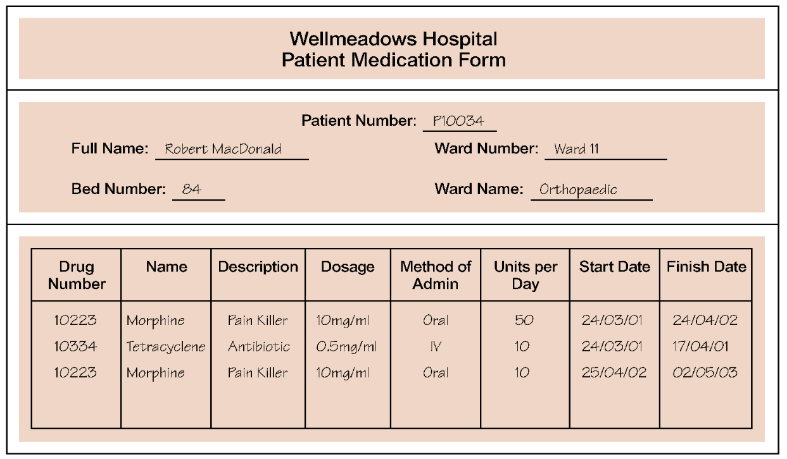

# 第三周  
---  

## 概率论与随机过程  
第十二章：  
- 9，10  

## 数据库系统原理  
### Assignment 8  
**下周一(05/20/2019)交**  
1. Describe what entity types represent in an ER model and provide examples of entities with a physical or conceptual existence.  
2. Describe what relationship types represent in an ER model and provide examples of unary, binary, ternary, and quaternary relationships.  
3. Describe what attributes represent in an ER model and provide examples of simple, composite, single-value, multi-value, and derived attributes.  
4. Describe what the multiplicity constraint represents for a relationship type. 5. What are enterprise constraints and how does multiplicity model these constraints?  
6. Describe the rules for deriving relations that represent: strong entity types; weak entity types; one-to-many (1:\*) binary relationship types; one-to-one (1:1) binary relationship types; one-to-one (1:1) recursive relationship types; many-to-many (\*:\*) binary relationship types; complex relationship types; multi-valued attributes.  
7. Create an ER diagram for each of the following descriptions:
	- (a) Each company operates four departments, and each department belongs to one company.  
	- (b) Each department in part (a) employs one or more employees, and each employee works for one department.  
	- (c) Each of the employees in part (b) may or may not have one or more dependants, and each dependant belongs to one employee.  
	- (d) Each employee in part (c) may or may not have an employment history.  
	- (e) Represent all the ER diagrams described in (a), (b), (c), and (d) as a single ER diagram.  
7. You are required to create a conceptual data model of the data requirements for a company that specializes in IT training. The Company has 30 instructors and can handle up to 100 trainees per training session. The Company offers five advanced technology courses, each of which is taught by a teaching team of two or more instructors. Each instructor is assigned to a maximum of two teaching teams or may be assigned to do research. Each trainee undertakes one advanced technology course per training session.  
	- (a) Identify the main entity types for the company.  
	- (b) Identify the main relationship types and specify the multiplicity for each relationship. State any assumptions you make about the data.  
	- (c) Using your answers for (a) and (b), draw a single ER diagram to represent the data requirements for the company.  
8. Derive relations for the following conceptual data model:  
  

### Assignment 9  
**下周五(05/24/2019)交**  
1. Describe the types of update anomalies that may occur on a relation that has redundant data.  
2. Describe the concept of functional dependency. 3. How is the concept of functional dependency associated with the process of normalization?  
4. Describe the concept of full functional dependency and describe how this concept relates to 2NF. Provide an example to illustrate your answer.  
5. Describe the concept of transitive dependency and describe how this concept relates to 3NF. Provide an example to illustrate your answer.  
6. Examine the Patient Medication Form for the Wellmeadows Hospital case study shown in Figure in next page.  
	- (a) Identify the functional dependencies represented by the data shown in the form in Figure 13.25.  
	- (b) Describe and illustrate the process of normalizing the data shown in Figure 13.25 to first (1NF), second (2NF), third (3NF), and BCNF.  
	- (c) Identify the primary, alternate, and foreign keys in your BCNF relations.  
  

## 毛泽东思想和中国特色社会主义理论体系概论  
- 社会实践论文
  **DDL：14周(05/27/2019)**  
	- 社会调查  
		- 3000字+  
		- 打印稿，加统一封面  
		- 后附两张调查照片  
		- 后附调查问卷样本，如果糅在了报告里可不附  
		- 诚信声明，一组一份  
	- 志愿报告  
		- 2000字+  
		- 手写稿，加统一封面  
		- 后附两张志愿照片，合照需将自己圈出来  
		- 诚信声明一份  
- 课本自选一章做PPT  
  **DDL：15周(06/03/2019)**  
