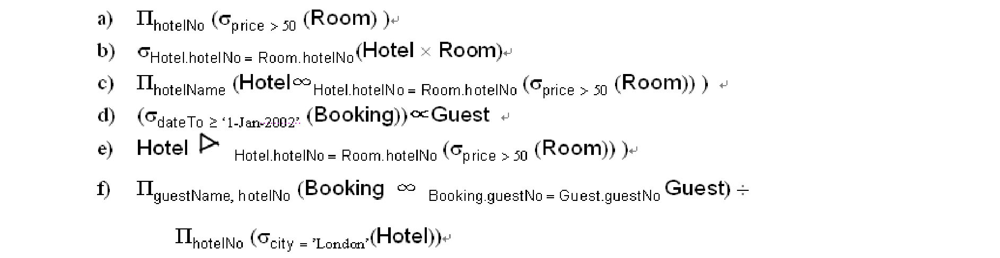

# 第四周  
---  
## 数据库系统原理    
1. Define the five basic relational algebra operations. Define the Join, Intersection, and Division operations in terms of these five basic operations.  
2. Discuss the difference between the five Join operations: Theta join, Equijoin, Natural join, Outer join, and Semijoin. Give examples to illustrate your answer. Use the Hotel schema defined at the Exercises at the end of Chapter 3, finish exercises 4 and 5.  
3. Describe the relations that would be produced by the following relational algebra operations:  
  
4. Generate the relational algebra for the following queries:  
	- (a) List all hotels.  
	- (b) List all single rooms with a price below £20 per night.  
	- (c) List the names and cities of all guests.  
	- (d) List the price and type of all rooms at the Grosvenor Hotel.  
	- (e) List all guests currently staying at the Grosvenor Hotel.  
	- (f) List the details of all rooms at the Grosvenor Hotel, including the name of the guest staying in the room, if the room is occupied.  
	- (g) List the guest details (guestNo, guestName, and guestAddress) of all guests staying at the Grosvenor Hotel.  

## 概率论与随机过程  
- 课本习题P59：33，34(2)，35(3)  
- 课本习题P84：2，3  

## 毛泽东思想和中国特色社会主义理论体系概论  
- 下周一（04/01/2019）交小组课堂建议  
- 八个幸运鹅手写作业  